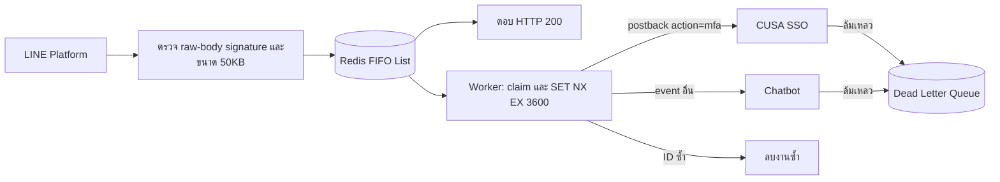

# SCICU Alumni Reunion API Gateway

Node.js / Express gateway สำหรับ `api.reunion.scicu-alumni.com` รับ LINE webhook แล้วส่งต่อผ่าน Upstash Redis ให้ CUSA SSO หรือ Chatbot ตาม SRS ใช้ worker ภายใน process และ recursive `setTimeout` โดยทำงานทีละ event ต่อ process พร้อมหน้าแอดมินที่เชื่อม CUSA SSO สำหรับเพิ่มแอปและแก้กฎ routing ใน Redis

## การทำงาน



ระบบรอ Redis ยืนยันการบันทึกก่อนตอบ `200` แต่ไม่รอ SSO/Chatbot ถ้า Redis ขัดข้องหรือคิวเต็ม จะตอบ `503` เพื่อให้ LINE ส่งซ้ำได้ **ต้องเปิด Webhook redelivery ใน LINE Developers Console** การส่งซ้ำขึ้นกับนโยบายของ LINE

| Endpoint | การยืนยันตัวตน | พฤติกรรม |
| --- | --- | --- |
| `POST /webhooks/line` | `x-line-signature`: HMAC-SHA256 ของ raw body | ตรวจ JSON หลัง signature ผ่าน และเข้าคิวทุก event แบบ atomic |
| `GET /ping` | `?secret=...` หรือ `X-Ping-Secret` | `200 {"ok":true}` เมื่อ process ตอบสนอง; ไม่ตรวจสถานะ Redis/ปลายทาง |
| `/admin/routes` | Login ผ่าน CUSA SSO | หน้าจัดการแอป กฎ และแอปสำรอง |
| `/v1/admin/webhook-routing` | BFF session จาก SSO + role `admin`; CSRF สำหรับ PUT | GET อ่านกฎ / PUT บันทึกกฎพร้อม revision ป้องกันการเขียนทับ |
| `/v1/*` อื่น | Bearer JWT แบบ RS256 | จุดสำหรับเพิ่ม CRUD; `503` หากยังไม่ตั้งค่า JWT, `401` หาก token ไม่ถูกต้อง, `404` หากยังไม่มี route |

LINE verification payload ที่มี `events: []` ตอบ `200` โดยไม่สร้างงาน คำขอที่ signature ผิดตอบ `401`, JSON/schema ผิดตอบ `400`, เกิน 50KB ตอบ `413`, content type หรือ content encoding ที่ไม่รองรับตอบ `415` และ HTTP ที่ไม่เข้ารหัสตอบ `426` ใน production

## เริ่มใช้งาน

ใช้ Node.js 22 ขึ้นไป และ Upstash Redis ที่เชื่อมต่อผ่าน TCP/TLS ได้ ไม่ใช้ REST URL/REST token แทน `REDIS_URL`

```sh
npm ci
cp .env.example .env
chmod 600 .env
```

เติมค่าลับใน `.env`:

| ตัวแปร | ค่า/ความหมาย |
| --- | --- |
| `LINE_CHANNEL_SECRET` | Channel secret จาก LINE Developers Console |
| `REDIS_URL` | `rediss://default:<password>@<endpoint>:6379` จาก Upstash; URL-encode อักขระพิเศษใน password |
| `INTERNAL_API_TOKEN` | Token ร่วมกับ SSO และ Chatbot อย่างน้อย 32 ตัวอักษร |
| `PING_SECRET` | Secret สำหรับ cron อย่างน้อย 32 ตัวอักษร และควรต่างจาก token ภายใน |
| `SSO_WEBHOOK_URL` | ไม่บังคับ: URL เริ่มต้นของแอป SSO ก่อนมี routing ใน Redis |
| `CHATBOT_WEBHOOK_URL` | ไม่บังคับ: URL เริ่มต้นของแอป Chatbot ก่อนมี routing ใน Redis |
| `TRUST_PROXY` | IP/CIDR ของ reverse proxy ที่เชื่อถือได้; ค่า `loopback` ในตัวอย่างต้องตรวจให้ตรงกับโฮสต์ |

สร้าง secret แต่ละค่าแยกกัน เช่น `openssl rand -hex 32` ห้าม commit `.env` หรือคีย์จริง ทุก environment variable อื่นอยู่ใน [.env.example](.env.example) หากต้องการแยก environment file อีกที่ ให้กำหนด `ENV_FILE=/absolute/private/path/.env` ผ่าน environment ของ Passenger ตัวแปรที่โฮสต์กำหนดไว้มีลำดับความสำคัญเหนือ `.env` ไฟล์ `.env` ที่มีอยู่แล้วต้องเก็บไว้ ไม่คัดลอกตัวอย่างทับ secrets เดิม

```sh
npm start
```

Production ต้องให้ HTTPS reverse proxy ส่งมายังแอป สำหรับพัฒนาในเครื่องให้ตั้ง `NODE_ENV=development`, `ENFORCE_HTTPS=false`, `TRUST_PROXY=false` โดย Redis และปลายทางยังต้องใช้ TLS เหมือนเดิม

## สัญญาการส่งต่อ

กฎเริ่มต้นส่ง event `type=postback` ซึ่ง `postback.data` มี `action=mfa` หนึ่งค่า เช่น `action=mfa&challenge=abc` ไป SSO; event อื่นไป Chatbot ไม่ใช้ substring matching; `action=not-mfa` และพารามิเตอร์ action ซ้ำไม่ตรงกฎ MFA

**เพิ่มแอปและเปลี่ยนเงื่อนไขที่ `/admin/routes`** ข้อมูลชื่อแอป, URL, event type, เงื่อนไข postback, ลำดับ/สถานะกฎ และแอปสำรองเก็บใน `webhook:config:routing` ไม่ใช้ `MFA_POSTBACK_PARAM`/`MFA_POSTBACK_VALUE` ใน `.env` อีกต่อไป Worker อ่านค่าปัจจุบันสำหรับทุกงานและใช้กฎแรกที่ตรง บันทึกแล้วมีผลกับงานถัดไปโดยไม่ restart รวมถึงงานที่ replay

หน้าจัดการรองรับคอมพิวเตอร์และมือถือ มี 4 เมนู:

- **ภาพรวม**: จำนวนแอป/กฎ สถานะเปิดใช้ และแผนภาพเส้นทางจากการตั้งค่าปัจจุบัน ไม่ใช่สถิติการส่งหรือผลตรวจสุขภาพระบบ
- **กฎส่งต่อ**: ค้นหา กรองสถานะ เพิ่ม แก้ไข ทำสำเนา เปิด/ปิด ลบ จัดลำดับด้วยลูกศร และเลือกแอปสำรอง
- **แอปปลายทาง**: ค้นหา เพิ่ม/แก้ไข URL แบบ HTTPS คัดลอก URL และตรวจการอ้างอิงก่อนลบ
- **ทดลองเส้นทาง**: จำลอง event พร้อมแสดงกฎที่ตรงและเหตุผลที่ข้ามแต่ละกฎ ใช้ฉบับแก้ไขในหน้านี้ โดยไม่มีการส่ง request ไปปลายทาง

การยืนยันในกล่องแก้ไขจะเปลี่ยนเฉพาะฉบับแก้ไข กด **บันทึกการเปลี่ยนแปลง** หรือ `Ctrl/Cmd + S` จึงบันทึกลงระบบ ปุ่มโหลดใหม่และออกจากระบบจะขอยืนยันหากยังมีรายการไม่บันทึก การบันทึกที่ชนกับผู้ดูแลคนอื่นจะเก็บฉบับแก้ไขไว้และแจ้งให้โหลดข้อมูลล่าสุด

ตัวนับด้านบนแสดงเวลาที่เหลือของเซสชัน หากหมดอายุ ฉบับแก้ไขยังอยู่ในหน้าเดิม ใช้ **เข้าสู่ระบบใหม่** ในแท็บใหม่ แล้วกลับมากด **ตรวจสอบการเข้าสู่ระบบ** เพื่อบันทึกต่อ ไม่เก็บฉบับแก้ไขหรือ token ลง localStorage; หากปิดหรือโหลดหน้าเดิมใหม่ ฉบับแก้ไขจะหาย เมนูคู่มือและกล่องแก้ไขรองรับคีย์บอร์ด/Escape และภาพเคลื่อนไหวเคารพ `prefers-reduced-motion`

`SSO_WEBHOOK_URL` และ `CHATBOT_WEBHOOK_URL` เป็นค่า bootstrap ที่เลือกตั้งได้เฉพาะตอน Redis ยังไม่มีกฎ ค่าเริ่มต้นคือ URL ตาม SRS หลังมีข้อมูลใน Redis แล้วให้เปลี่ยนผ่านหน้าแอดมินเท่านั้น

ทุก request ปลายทางเป็น `POST` และมี headers:

```text
Content-Type: application/json
Authorization: Bearer <INTERNAL_API_TOKEN>
X-Webhook-Event-Id: <webhookEventId>
Idempotency-Key: <webhookEventId>
```

Body เป็น LINE envelope ที่เก็บ `destination` และ **หนึ่ง event ต่อ request**:

```json
{
  "destination": "U...",
  "events": [{ "type": "postback", "webhookEventId": "...", "postback": { "data": "action=mfa" } }]
}
```

Event object รวมทั้ง `replyToken`, source และข้อมูลอื่นภายใน event ถูกเก็บตามที่ได้รับ ไม่ส่ง `x-line-signature` เดิมต่อ เพราะ body ถูกแยกเป็นราย event แล้ว **SSO และ Chatbot ต้องตรวจ Internal API Token ของ gateway** หากปลายทางเดิมรับเฉพาะ LINE signature ต้องปรับให้รองรับสัญญานี้

HTTP `2xx` ถือว่าสำเร็จ; `3xx`, `4xx`, `5xx`, timeout และ network error เข้า DLQ ทั้งหมด ระบบไม่ตาม redirect เพื่อไม่ส่ง token ไปยัง URL ใหม่ Timeout ค่าเริ่มต้น 4 วินาที ปรับได้ 3–5 วินาที และไม่อ่าน response body มาบันทึก

## Queue, idempotency และการกู้คืน

| Redis key | Type | หน้าที่ |
| --- | --- | --- |
| `webhook:queue:events` | List | `LPUSH` ตอนรับงาน และ `RPOP` ตอน claim: FIFO ตามลำดับที่รับเข้าคิว |
| `webhook:dlq:events` | List | งานล้มเหลวพร้อมเวลา, target และ error metadata |
| `webhook:idempotency:{webhookEventId}` | String | `SET NX EX 3600` ก่อน forward; เก็บ job ID ที่จอง event |
| `webhook:processing:events` | Hash | เก็บงานที่ worker claim แต่ยังไม่จบ โดยใช้ receipt ID |
| `webhook:processing:leases` | Sorted set | เวลาหมดอายุของ claim ตามนาฬิกา Redis |
| `webhook:config:routing` | String / JSON | แอป กฎ แอปสำรอง และ revision; ไม่มี TTL |
| `webhook:auth:state:{hash}` | String / JSON | PKCE verifier กับ browser binding; TTL 600 วินาที ใช้ได้ครั้งเดียว |
| `webhook:auth:session:{hash}` | String / JSON | SSO access token กับ CSRF token; TTL ไม่เกิน 300 วินาที |

Main queue เก็บ JSON `{version, id, receivedAt, payload}` หนึ่ง event ต่อ job การตรวจ capacity และเพิ่มทุก event ใน request ใช้ Lua script เดียว จึงไม่มีการรับเพียงบางส่วนของ batch ค่า `QUEUE_MAX_LENGTH` นับรวมงานที่กำลังทำอยู่ เมื่อเต็มจะปฏิเสธ request ใหม่ด้วย `503` โดยไม่ลบงานเก่า

Claim จะย้าย payload ไป processing แบบ atomic ก่อนคืนให้ worker; ack จะลบ processing หลังสำเร็จ ส่วนการเข้า DLQ และลบ processing ใช้ script เดียวกัน หาก process ถูก kill หรือบันทึกผลไม่ได้เพราะ Redis ขัดข้อง งานจะยังอยู่ใน processing เมื่อ lease หมดอายุ (เริ่มต้น 30 วินาที) worker ที่ทำงานรอบต่อไปจะย้ายเข้า DLQ ด้วย `interrupted` เพื่อให้ผู้ดูแลตรวจผลก่อนส่งซ้ำ ไม่มีการกู้คืนขณะที่ทุก process ถูก suspend

DLQ เก็บข้อมูลดังนี้; `rawJob` เป็น JSON string ของ job เดิม:

```json
{
  "rawJob": "{...}",
  "failedAt": 1780000000000,
  "target": "chatbot",
  "error": { "kind": "http_error", "status": 500 }
}
```

`error.kind` ใช้ `http_error`, `timeout`, `network_error`, `invalid_job` หรือ `interrupted` โดยไม่มี exception message, response body หรือ URL ใน metadata งานที่หมด lease อาจไม่มี `target` เนื่องจากไม่ทราบว่าส่งถึงขั้นตอนไหนแล้ว

ส่งงานเก่าสุดใน DLQ กลับเข้าคิวทีละหนึ่งงาน:

```sh
npm run dlq:replay -- --oldest
```

คำสั่งจะย้ายงานและลบ idempotency marker ที่เป็นของ job นั้นแบบ atomic โดยไม่พิมพ์ payload หากมี marker ของงานใหม่กว่า จะคืน `conflict` และคง DLQ ไว้ ถ้าคิวเต็มคืน `full`; งานที่อ่านไม่ได้คืน `invalid`; ไม่มีงานคืน `empty` คำสั่งนี้มีไว้ให้ผู้ดูแลรันหลังตรวจและแก้เหตุขัดข้อง

การส่ง HTTP กับการบันทึกผลใน Redis ไม่ใช่ transaction เดียวกัน จึง **ไม่รับประกัน exactly-once** หากปลายทางรับแล้วแต่การตอบกลับหาย งานอาจเข้า DLQ ทั้งที่ปลายทางทำงานแล้ว ต้องตรวจสถานะก่อน replay โดยเฉพาะ MFA และให้ปลายทางรองรับ `Idempotency-Key` ด้วย การ deduplicate ของ gateway มีอายุ 1 ชั่วโมงและยังคง marker สำหรับงานล้มเหลวจนหมดอายุหรือ replay อย่างชัดเจน

List รับและ claim ตาม FIFO แต่หลาย process อาจทำงานเสร็จสลับลำดับ และ LINE redelivery อาจเข้ามาผิดลำดับเวลา event หากต้องการลำดับการส่งต่อแบบเข้มงวด ให้ตั้ง Passenger เป็นหนึ่ง app process และตรวจ `timestamp` ตามธุรกิจ

## ติดตั้งบน HostAtom / Plesk

ใช้ [คู่มือติดตั้ง Plesk](deploy/PLESK.md) สำหรับขั้นตอน File Manager, Node.js, SSO และ Scheduled Tasks

| Plesk setting | ค่า |
| --- | --- |
| Application Root | `reunion-gateway` |
| Document Root | `reunion-gateway/public` |
| Application Startup File | `app.js` |
| Application Mode | production |
| Node.js | 22 ขึ้นไป |

เก็บ `.env`, logs และ JWT key นอก Document Root; `app.js` รองรับทั้งการรันตรงและการโหลดผ่าน `require()` ของ Passenger พร้อมรับ Passenger `exit` event เพื่อปิดงานอย่างปลอดภัย ดู [เอกสาร Plesk](https://docs.plesk.com/en-US/obsidian/administrator-guide/website-management/nodejs-support.76652/)

```sh
npm run config:check
npm run config:check -- --redis
npm run package:deploy
```

`config:check` รายงานชื่อค่าที่ต้องแก้โดยไม่แสดง secret; `--redis` ตรวจ TLS/auth ด้วย PING และไม่แตะงานในคิว ส่วน `package:deploy` สร้าง `dist/reunion-gateway-plesk.zip` กับ SHA-256 โดยไม่รวม `.env`, logs หรือ node_modules

ตั้ง keep-alive ทุก 5 นาทีผ่าน Plesk Scheduled Tasks → Run a command โดยใช้ [private curl config](deploy/keepalive.curl.example) ที่มี `X-Ping-Secret` ค่า `/ping` บอกเพียงว่า process ตอบสนอง ไม่ยืนยัน Redis และไม่รับประกันว่าผู้ให้บริการจะไม่ suspend process

## CUSA SSO สำหรับหน้าแอดมิน

ตั้ง `SSO_ORIGIN`, `SSO_APPLICATION_ID`, `SSO_API_KEY` และ `SSO_REDIRECT_URI` ตาม [.env.example](.env.example) ต้องลงทะเบียน callback `https://api.reunion.scicu-alumni.com/auth/sso/callback` และให้บัญชีผู้ดูแลมี role `admin` ของแอปนี้

OpenAPI 1.4.0 ที่ผู้ใช้ให้มาระบุ **opaque token + Authorization Code/PKCE S256** ไม่มี JWT, discovery, JWKS หรือ refresh token สำหรับ flow นี้ Gateway ตรวจ `/api/sso/introspect` ทุกครั้ง โดยตรวจ `active`, `aud`, `exp`, `scope` และ `roles.includes('admin')` ไม่ใช้ role ส่วนกลางของ CUSA หรือข้อมูลที่ browser ส่งมาอ้างเอง

API key อยู่ฝั่ง backend และส่งเป็น `X-API-Key` สำหรับ token/introspect/revoke ต้องมี scopes `identity:read`, `token:introspect`, `token:revoke` ขอข้อมูลผู้ใช้เพียง `identity:read` ไม่ขอ email/profile

หน้าแอดมินถือ HttpOnly/Secure/SameSite cookie และ CSRF token; access token เก็บใน Redis ไม่ส่งไป JavaScript และไม่มี localStorage session มีอายุสูงสุด 5 นาที เมื่อหมดอายุต้อง login อีกครั้ง ไม่มีการยืดอายุ token โดย gateway

การบันทึก routing ต้องผ่าน same-origin + CSRF check และ role admin กฎมี revision; ถ้ามีผู้ดูแลอีกคนบันทึกก่อน จะได้ `409` ให้โหลดใหม่ ข้อมูลผิดหรือ URL ไม่ใช่ HTTPS ตอบ `400`; Redis/SSO ใช้งานไม่ได้จะปฏิเสธการทำงาน

OpenAPI นี้ไม่ได้ระบุ `/api/line/mfa` จึงยังต้องยืนยันสัญญาปลายทาง LINE MFA จาก SRS เดิมกับทีม SSO การ login ใช้ `SSO_API_KEY` ส่วน webhook forwarding ใช้ `INTERNAL_API_TOKEN` คนละค่าและคนละหน้าที่

## JWT สำหรับ resource `/v1` ในอนาคต

ตั้ง `JWT_PUBLIC_KEY_PATH`, `JWT_ISSUER`, `JWT_AUDIENCE` ให้ครบ ใช้ RSA public key อย่างน้อย 2048 บิต อัลกอริทึมที่ยอมรับคือ `RS256` เท่านั้น ตรวจ issuer, audience, expiry และ `sub`; ยอมให้เวลาคลาดเคลื่อน 5 วินาที จากนั้นเพิ่ม resource routers ใน `src/routes/v1.js` โดยใช้ `req.auth` และตรวจสิทธิ์การเข้าถึงของแต่ละ resource เพิ่มเติม เส้นทาง `/v1/admin/*` ใช้ SSO session แยกจาก JWT เหล่านี้ ยังไม่ได้สร้าง CRUD ของทรัพยากรอื่นที่ไม่มี schema ใน SRS

## Logs และการหยุดระบบ

Winston หมุน log ทุกวัน UTC และเมื่อถึง `LOG_MAX_SIZE` (เริ่มต้น 10MB ต่อไฟล์) เก็บ 7–14 วันตาม `LOG_RETENTION_DAYS` (เริ่มต้น 14) การลบตาม retention เกิดเมื่อมีการหมุนไฟล์ ไฟล์อยู่ใน private `LOG_DIR` และใช้ permission `600` ทั้งแอปใช้ restrictive umask

Log รับเฉพาะรหัสเหตุการณ์ที่กำหนดไว้และ metadata เช่นจำนวนงาน, HTTP status, ระยะเวลา, ชื่อ target ไม่บันทึก raw request, ข้อความแชต, user/event ID, URL, token, exception message/stack หรือ response body ของปลายทาง ค่า log จึงไม่ใช้แทนการเก็บ payload สำหรับ debug

Payload จริงยังอยู่ใน Redis main/processing/DLQ เพื่อประมวลผลและ replay: จำกัดผู้เข้าถึง Redis และกำหนดระยะเวลาเก็บ DLQ ให้ตรงนโยบายข้อมูลขององค์กร ไม่มีการ trim/ลบ DLQ อัตโนมัติเพราะจะทำให้งานที่ต้องกู้คืนสูญหาย ควรแจ้งเตือนเมื่อ DLQ ไม่ว่าง, มี `queue_unavailable`/`worker_error` หรือมีงานค้างนาน และติดตาม quota ของ Upstash เพราะ idle polling ก็ใช้คำสั่ง Redis

`SIGTERM`/`SIGINT` หยุดรับ request ใหม่และหยุดตั้งรอบ worker รอ request กับงานปัจจุบันจบ แล้ว `QUIT`/disconnect Redis และ flush log ก่อนออก หากเกิน deadline (เริ่มต้น 15 วินาที) จะตัด connection และออก; งานที่ค้างใน Redis จะถูกกู้เข้า DLQ เมื่อ worker กลับมา

## ทดสอบ

```sh
npm run check
npm test
```

Integration suite ต้องมี `openssl` และ `redis-server` ที่ build รองรับ TLS:

```sh
REDIS_SERVER_BIN=/path/to/redis-server npm run test:redis
```

ชุดทดสอบสร้าง Redis แยกพร้อม certificate ชั่วคราวและ random port ในเครื่อง ไม่ใช้ production `REDIS_URL` และปิด/ลบ fixture เมื่อจบ ครอบคลุม FIFO, enqueue ทั้ง batch, capacity, idempotency ระหว่าง worker, DLQ/replay, stale claim, TLS verification, reconnect, command timeout , SSO PKCE/session/CSRF, dynamic routing และ lifecycle ของ entrypoint ทั้ง direct/Passenger ส่วน HTTP/worker tests ตรวจ signature, 50KB, auth, routing, timeout/redirect, log privacy และ graceful shutdown

ยังต้องทดสอบบน HostAtom Plesk กับ Upstash/SSO/Chatbot จริงหลังใส่ credentials โดยเฉพาะ proxy headers, outbound TLS, Passenger lifecycle และสัญญา auth ของปลายทาง

## ความสัมพันธ์กับ SRS

| Requirements | ตำแหน่งหลัก |
| --- | --- |
| FR-01, SR-02 JWT | `src/app.js`, `src/routes/v1.js`, `src/middleware/security.js` |
| FR-02, FR-03, SR-01, SR-03 | `src/routes/webhooks.js`, `src/payload.js` |
| FR-04, FR-06, FR-08 | `src/queue.js` |
| FR-05, FR-07, NFR-01 | `src/worker.js`, `src/routing.js`, `src/routing-store.js`, `app.js` |
| Dynamic routing / SSO admin | `src/sso.js`, `src/routes/auth.js`, `src/routes/admin.js`, `public/admin/` |
| FR-09, SR-02 ping | `src/app.js`, `deploy/keepalive.curl.example` |
| SR-02 service token, NFR-03 | `src/forward.js` |
| SR-04, NFR-02 | `src/logger.js` |
| SR-05, NFR-04 | `src/config.js`, `src/redis.js`, `src/app.js` |
| NFR-05 | `src/shutdown.js`, `app.js` |

รายละเอียดอ้างอิง: [LINE signature](https://developers.line.biz/en/docs/messaging-api/verify-webhook-signature/), [LINE redelivery](https://developers.line.biz/en/docs/messaging-api/receiving-messages/), [Express proxy trust](https://expressjs.com/en/guide/behind-proxies/), [Upstash TLS](https://upstash.com/docs/redis/features/security), [ioredis connection options](https://github.com/redis/ioredis), [Winston rotation](https://github.com/winstonjs/winston-daily-rotate-file)
